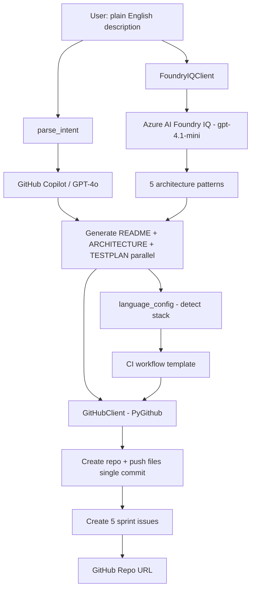

# Project Kickstart Agent

Describe your project in plain English, get a real GitHub repo back in about a minute and a half.

## Problem

I kept noticing that the first hour of any new project is always the same. Make the folders. Write the throwaway README. Copy the `.env.example` from the last thing I built. Open the same five issues I always open. None of it is hard, it's just friction, and it's the worst possible thing to be doing when you actually have momentum on a new idea.

So I wanted something that takes that whole first hour off my plate.

## Solution

It's a single CLI command. You give it a sentence about what you want to build, and it does the boring setup for you:

1. Works out what you're actually building (the name, the stack, what kind of project it is)
2. Writes a README that fits that project
3. Lays out a starter folder structure with real files in it
4. Spins up the GitHub repo
5. Pushes everything up
6. Opens five issues so you've got a backlog waiting

By the time it's done you've got a repo you can clone and start working in, instead of a blank `git init`.

## Architecture

The whole thing runs as a sequence of steps inside `ProjectKickstartAgent.run()`. Each step either works or fails loudly and stops, which made debugging a lot less painful.

```
main.py  →  ProjectKickstartAgent.run()
               │
               ├── parse_intent()         → ask GPT-4o for name, stack, type, language
               ├── architecture patterns  → Azure AI Foundry IQ (gpt-4.1-mini) retrieves stack-specific patterns
               ├── generate README        → GPT-4o writes the README
               ├── generate file tree      → GPT-4o returns JSON of path → contents
               ├── create repo            → PyGithub makes the public repo
               ├── push files             → PyGithub commits everything
               └── create issues          → GPT-4o drafts 5 issues, PyGithub opens them
```

Two pieces do most of the work. `CopilotClient` talks to the GitHub Models API and is responsible for anything that needs the model to think. `GitHubClient` wraps PyGithub and handles the repo, the file commits, and the issues.

## Architecture Diagram



## Tech Stack

- Python 3.11
- GitHub Models API (GPT-4o) for all the generation
- PyGithub for talking to GitHub
- click for the CLI
- rich for the terminal output
- python-dotenv for config
- Azure AI Foundry IQ (gpt-4.1-mini) — architecture pattern retrieval

## How to Run

Clone it and set up a virtual environment:

```bash
git clone https://github.com/nikhiltulsani1/project-kickstart-agent.git
cd project-kickstart-agent
python -m venv .venv

# Windows
.venv\Scripts\activate
# Mac/Linux
source .venv/bin/activate

pip install -r requirements.txt
```

Copy the example env file and fill in your details:

```bash
cp .env.example .env
```

```
GITHUB_TOKEN=your_pat_with_repo_scope
GITHUB_USERNAME=your_github_username
AZURE_FOUNDRY_ENDPOINT=your_endpoint_here
AZURE_FOUNDRY_KEY=your_key_here
```

The token needs `repo` scope. The same one is used for both the Models API and creating the repo, so you only need the one.

Then point it at an idea:

```bash
python main.py "A FastAPI task manager with Postgres and JWT auth"
```

You'll watch the steps tick by in the terminal, and at the end it hands you a link to the new repo.

## Demo

▶️ [Watch the demo](https://youtu.be/nPi7PBqIvOs) — link updated after recording

> Agent runs under 90 seconds end-to-end. Generates README,
> ARCHITECTURE.md, TESTPLAN.md, CI workflow, folder structure,
> and 5 sprint issues in a single commit.

## What I Learned

Honestly, the biggest surprise was how much the boring engineering
decisions mattered more than the AI parts.

**Use templates for anything that needs to be correct, not creative**
I started by asking GPT-4o to generate CI YAML. It worked most of the
time — until it didn't. Malformed indentation, wrong action versions,
missing steps. Switched to a template engine driven by a language config
dict and the problem disappeared instantly. 2.5 seconds became 0 seconds
and I stopped debugging YAML at midnight. If the output needs to be
deterministic, don't use an LLM.

**Compiled languages don't forgive placeholder code**
Python doesn't care if your stub files are half-empty. Java and Go do.
A pom.xml with a comment instead of real XML crashes Maven before it
reads a single line of your code. A Go import path that doesn't match
your module name breaks the entire build. Spent more time debugging
Java compilation errors than any other single thing. Lesson: every
generated file has to be syntactically valid, even if it does nothing.

**Pushing files one by one is embarrassingly slow**
First version pushed each file in a separate API call. 11 files =
11 commits = 22 seconds and a commit history that looked like I'd
never heard of git. Switched to PyGithub's git tree API — everything
in one commit, 6 seconds. Should have done this on day one.

**Rate limits hit faster than you expect**
50 requests per day sounds like a lot until you're running end-to-end
tests every 10 minutes. Built automatic fallback to gpt-4.1-nano on
HTTP 429 — the agent switches models mid-session without interrupting
the user. Standard pattern in production systems, not something I'd
thought to add to a hackathon project until I needed it urgently.

**Parallel LLM calls are an obvious win in hindsight**
README, architecture doc, and test plan were all generated sequentially
at first. They don't depend on each other at all — pure waste. Three
Python threads later, 30 seconds became 16 seconds. Every time you
have independent LLM calls, run them together.

**PyGithub has one annoying quirk worth knowing**
Calling get_contents() on a repo with no commits returns a 404, not
an empty list. Took longer to debug than it should have because the
error message doesn't make it obvious. If you're pushing to a brand
new repo, handle the 404 as the "repo is empty" case.

## AI Tools Used During Development

- GitHub Copilot (VS Code) for day-to-day coding
- GitHub Models API, which is also what powers the agent itself
- Claude Code for setting up the project and some of the architecture decisions
- Azure AI Foundry IQ (gpt-4.1-mini) — architecture pattern retrieval, live

## Reliability & Safety

- **Three-tier model fallback** — calls go to GPT-4o through GitHub Models first. If it hits a rate limit, the tool quietly switches to gpt-4.1-nano in the middle of a run and keeps going — the person never notices. Architecture patterns try Azure Foundry first, then GitHub Models, then a sensible built-in list. Nothing ever hard-fails.
- **Secrets get stripped before anything is pushed** — generated files are checked for things that look like real API keys or tokens, and those get redacted before the commit goes up. The tool won't leak a credential into a public repo.
- **CI is built from templates, not generated** — so the YAML is always valid. Every new repo comes back with a green check on the first commit.
- **Generated files actually compile** — Go module names match the import paths, the Java pom.xml is a real working Spring Boot file, not a stub with a comment in it. Five languages, all valid.
- **33 tests** cover the whole flow — parsing the description, generating the files, creating the repo, the CI step, and language detection across every supported stack.

## Built By

**Nikhil Tulsani**
- Microsoft Learn Username: NikhilTulsani-1371
- GitHub: [@nikhiltulsani1](https://github.com/nikhiltulsani1)
- Hackathon: Microsoft Agents League 2026
- Hackathon Registered Mail : Nikhil.tulsani1@gmail.com
